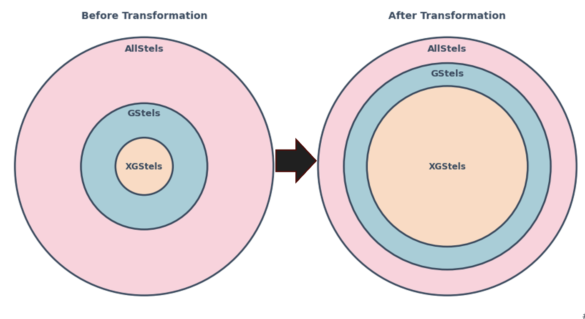
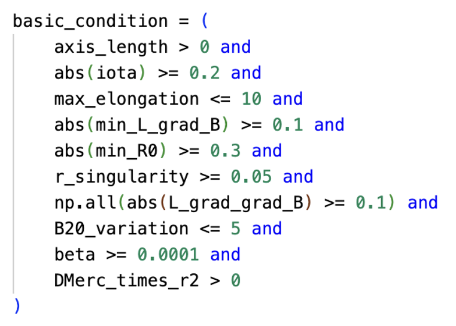
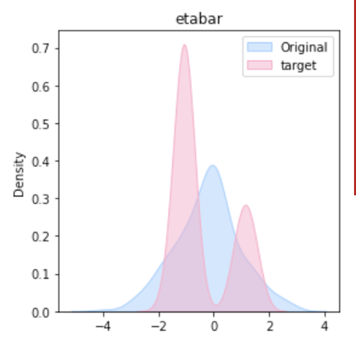
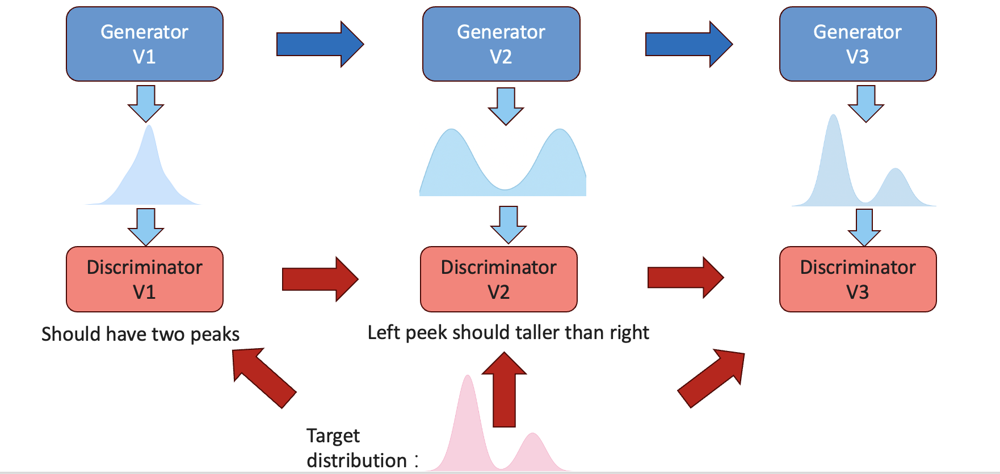
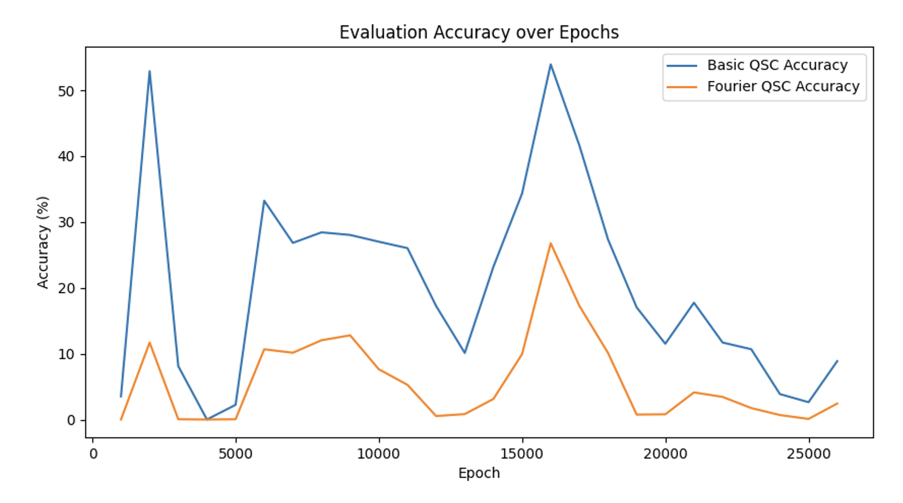
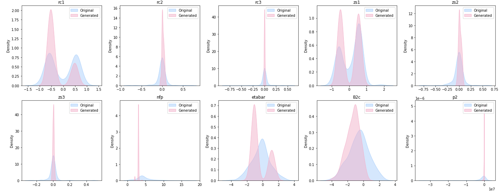
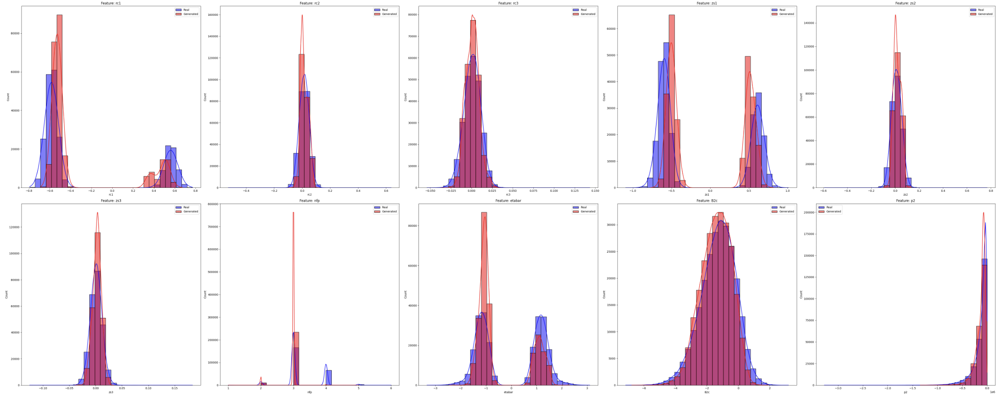
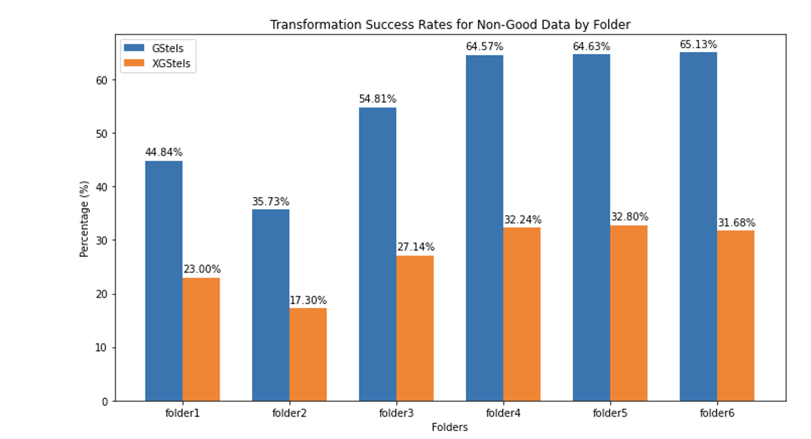

# Stellarator Data Transformation via CycleGAN

This project aimed at transforming non-good stellarator configuration data into “good” ones that satisfy our design criteria. The overall approach employs a CycleGAN model to adjust the distributions of key parameters, thereby generating more useful stellarator configurations (referred to as Gstels and, when meeting an additional plot criterion, as XGstels).

  

## Overview

- **Problem Statement:**  
  Stellarator configuration data is divided into many subsets (from six different folders). Configurations that meet a set of criteria (listed in the following table) are labeled as Gstels. Within these, configurations that can also be plotted using `r = 0.1` are marked as XGstels. The goal is to transform many non-good data points into ones that satisfy both checks.

    
  
- **Approach:**  
  A CycleGAN model is used to learn the mapping from non-good to good data, particularly focusing on transforming parameter distributions such as the `etabar` distribution. The model exploits the adversarial interplay between a generator and a discriminator to gradually reshape the data distribution.

---

## CycleGAN Model Training

### Transformation of Distributions

  

- **Initial State:**  
  The original `etabar` distribution for non-good configurations resembles a normal distribution.

  
- **Target Distribution:**  
  The desired distribution (from Gstels) is bimodal with two peaks. Early in training, the generator produces outputs that still follow a normal distribution.

  

- **Evolution Through Adversarial Training:**  
  1. **Generator Version 1 (V1):**  
     Initially produces data following a normal distribution.
  2. **Discriminator V1:**  
     Learns from the target bimodal distribution, identifying discrepancies (e.g., the presence of two peaks).
  3. **Generator V2:**  
     Adjusts to produce distributions with two peaks but still may require improvements in peak height ratios.
  4. **Discriminator V2:**  
     Further refines the criteria by learning that the left peak should be taller than the right.
  5. **Generator Version 3 (V3):**  
     Finally evolves to produce the expected distribution where the left peak is more pronounced than the right.

---

### Training Process

- **Infinite Loop of Epochs:**  
  An infinite while loop is defined during training, where in each epoch the model is updated.
  
- **Periodic Evaluation:**  
  Every 1000 epochs, the current model is used to transform 30,000 non-good data points. The proportion of data passing both checks is computed.

- **Convergence Criteria:**  
  The training loop terminates when there is no increase in the pass rate for 10 consecutive evaluations.
  
- **Final Testing:**  
  An additional one million non-good stellarator data points are processed, resulting in approximately 26% of the data being successfully transformed into XGstels.

---

## Evaluation & Observations

### Performance Analysis

- **Evaluation Metric:**  
  The evaluation is based on hard binary criteria (e.g., whether an axis length is greater than zero), which makes the metric non-continuous and may contribute to fluctuations in the evaluation curve.
  
- **Plot Analysis:**  
  The change in the proportion of data passing both checks during training exhibits a curve that is not as smooth as expected. Three possible reasons for this behavior are:
  1. **Binary Evaluation Criteria:**  
     The use of a hard 1/0 pass/fail system results in a non-smooth metric.
  2. **Model Complexity:**  
     The relative simplicity of the current model may limit its performance.
  3. **Training Dynamics:**  
     Imbalances where either the generator becomes too strong or the discriminator lags behind could also affect performance.

    
  *Figure: Training curve indicating the pass rate over different epochs.*

### Data Distribution Shifts

- **Pre- and Post-Transformation Comparison:**  
  A comparison between the data that passed both checks before and after transformation reveals that the model effectively shifts the distribution toward the target profile.

    
  *Figure: Distribution of data before (blue) and after (orange) transformation.*

- **Comparison with Real XGstels:**  
  Distributions of transformed data that passed both checks were nearly identical to those of the actual XGstels, confirming the efficacy of the transformation process.
   


### Folder-specific Performance

- **Uneven Model Performance Across Folders:**  
  The data is sourced from six folders. Testing revealed that the model performs differently:
  - **Better Performance:**  
    In the last three folders.
  - **Suboptimal Performance:**  
    In the first three folders.
    
    

This suggests that the quality or characteristics of the data across folders may vary, influencing the transformation effectiveness.

---

## How to Apply the Code

### 1. Environment Setup

Ensure that you have installed the following Python libraries:
- `argparse`
- `torch`
- `pandas`
- `numpy`
- `matplotlib`
- `scikit-learn`

Make sure the project's dependencies (`model` and `qsc`) are available in your project directory.

### 2. Data Preparation

- Place your input CSV file (e.g., `new_data.csv`) containing configuration data into the `data/` folder.
- Ensure that the scaler parameter files (`scaler_X_mean.npy`, `scaler_X_std.npy`, `scaler_Y_mean.npy`, `scaler_Y_std.npy`) exist.
- Verify that the trained generator model file `G_A2B_best_model.pth` is located in the project root or update the `--model_path` parameter accordingly.

### 3. Running the Code

The code performs data generation and (optionally) additional filtering. It consists of the following phases:


#### **Filtering Phase (Optional):**
1. **Basic Filtering:**  
   Uses Qsc evaluation to filter out configurations that do not meet pre-defined criteria.
   
2. **Fourier-Based Filtering:**  
   Further processes the data by converting them into Fourier coefficients and applies additional checks.

#### **Example Command:**

```bash
python your_script.py --input_csv data/new_data.csv \
                      --generated_csv data/generated_output.csv \
                      --model_path G_A2B_best_model.pth \
                      --filter True \
                      --basic_out_csv data/generated_output_basic.csv \
                      --fourier_out_csv data/generated_output_fourier.csv
